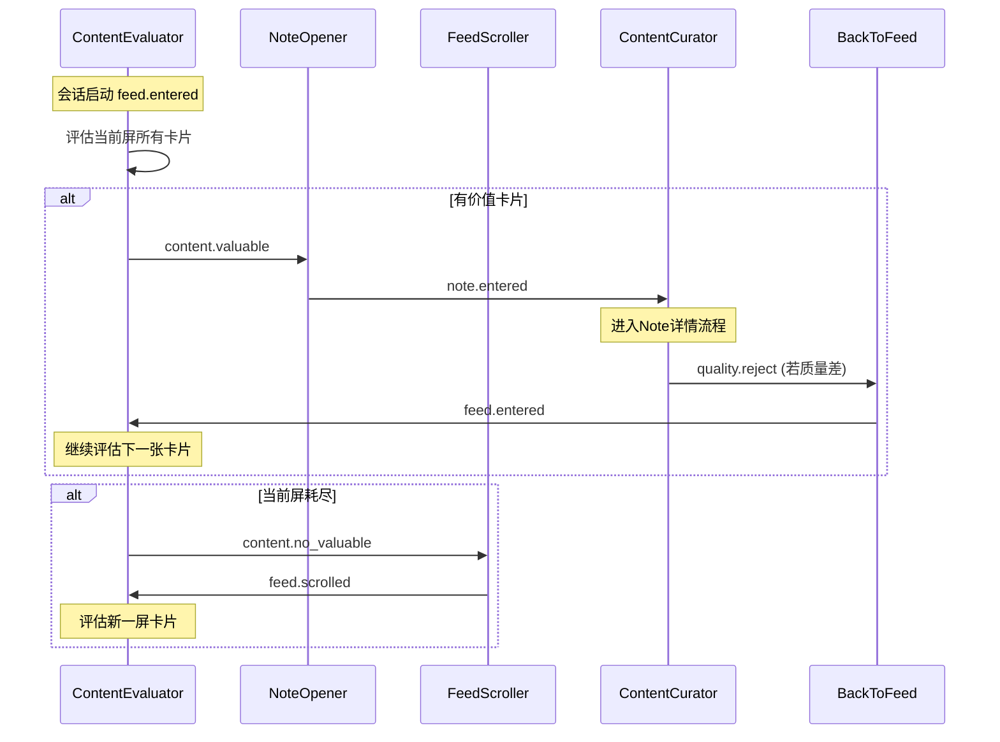
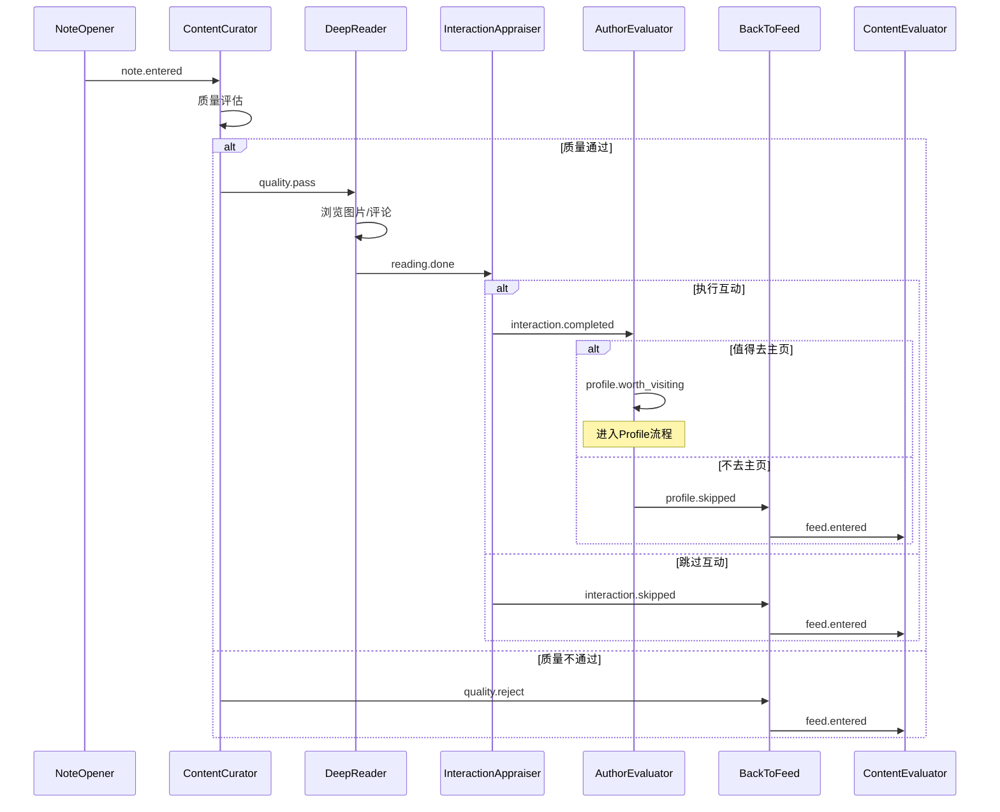
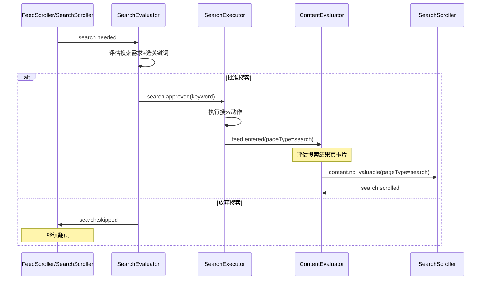
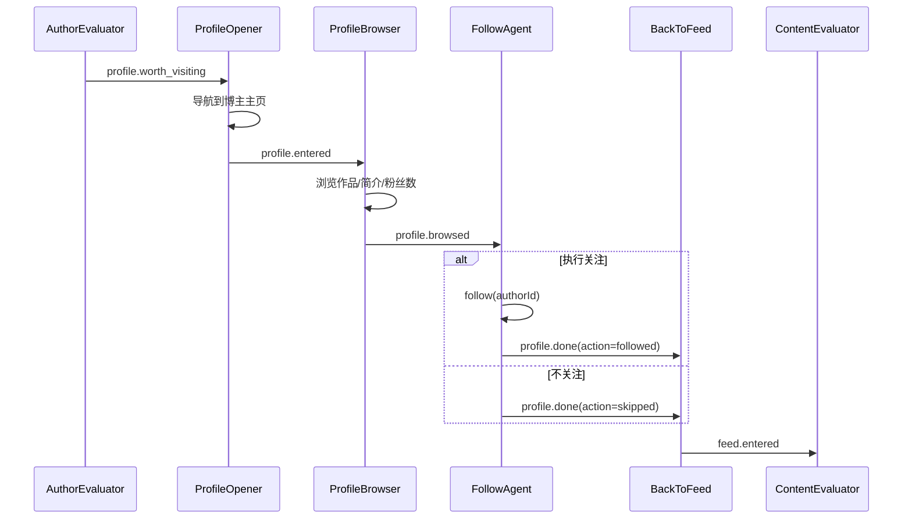

# 多Agent角色协作架构设计文档

> 模拟人类浏览小红书的事件驱动多Agent系统

---

## 1. 设计原则

### 1.1 单一职责

一种交互行为对应一个独立角色，禁止在单个角色内混合多种行为。

- **正例**：`FeedScroller` 只做 Feed 翻页，`NoteOpener` 只做点击进入详情页
- **反例**：一个角色同时负责翻页和打开笔记（❌ 违反单一职责）

### 1.2 EventBus 解耦

角色间**只通过 EventBus 发布/订阅通信**，不直接调用其他角色的方法或持有其他角色引用。

- 角色只知道自己消费什么事件、产出什么事件
- 角色之间零耦合，可独立测试、独立部署

### 1.3 闭环归一

所有执行路径最终回到 **ContentEvaluator**（Feed/Search 列表评估入口），形成完整闭环。

- 无论走了多深的路径（详情页→互动→博主主页→关注），最终一定通过 `feed.entered` 回到 ContentEvaluator
- 系统不存在"死胡同"路径

### 1.4 单出口

每个事件有且只有**一个消费者**。

- 保证事件流的确定性：给定一个事件，必定只有一个角色被唤醒
- 消除多消费者导致的竞争和不确定性

### 1.5 分支在生产者不在消费者

一个角色可以根据评估结果输出**多种不同事件**（分支决策），但每种事件只流向唯一的下一个角色。

- **正例**：ContentEvaluator 可能输出 `content.valuable` 或 `content.no_valuable`，分别流向不同角色
- **反例**：一个消费者角色根据事件 payload 内的 flag 来决定不同处理逻辑（❌ 违反单出口）

### 1.6 人类行为模拟

角色拆分依据是**人类浏览网站的真实思维流程**，而非技术模块划分。

- 人类在列表页看到感兴趣的内容 → 点击 → 阅读 → 决定互动 → 可能去看博主主页 → 返回列表
- 每个心理决策节点对应一个 Agent 角色

---

## 2. 角色清单

| # | 角色 | 类型 | 所在页面 | 核心职责 |
|---|------|------|---------|---------|
| 1 | FeedScroller | 执行 | Feed | 主Feed翻页scroll |
| 2 | SearchScroller | 执行 | Search | 搜索结果页翻页scroll |
| 3 | ProfileBrowser | 执行 | Profile | 浏览博主主页内容（作品列表、简介、粉丝数） |
| 4 | ContentEvaluator | 评估 | Feed/Search | 列表页卡片价值判断（含已访问标记） |
| 5 | NoteOpener | 执行 | Feed/Search | 点击卡片进入详情页 |
| 6 | ContentCurator | 评估 | Note | 详情页内容粗筛（质量关卡） |
| 7 | DeepReader | 执行 | Note | 深度阅读（浏览全部图片、评论区） |
| 8 | InteractionAppraiser | 评估+执行 | Note | 判断并执行点赞/收藏 |
| 9 | AuthorEvaluator | 评估 | Note | 判断是否值得进入博主主页 |
| 10 | ProfileOpener | 执行 | Note→Profile | 点击进入博主个人主页 |
| 11 | FollowAgent | 评估+执行 | Profile | 判断并执行关注 |
| 12 | SearchEvaluator | 评估 | Feed/Search | 判断是否需要搜索+选关键词 |
| 13 | SearchExecutor | 执行 | Feed/Search | 执行搜索动作 |
| 14 | BackToFeed | 执行 | 任意 | 返回来源列表页 |
| 15 | SessionMonitor | 风控 | 全局 | 会话生命周期管控（veto/gate） |

---

## 3. 角色详细定义

### 3.1 FeedScroller

| 维度 | 说明 |
|------|------|
| **职责边界** | 消费 `content.no_valuable` (pageType=feed) 后执行 scroll 操作，加载下一屏内容 |
| **不做什么** | 不评估内容价值、不点击笔记、不执行搜索 |
| **所在页面** | Feed |
| **消费事件** | `content.no_valuable` (当 pageType='feed') |
| **产出事件** | `feed.scrolled` → ContentEvaluator<br>`search.needed` → SearchEvaluator（连续N次无价值后触发） |
| **关系** | 上游: ContentEvaluator；下游: ContentEvaluator, SearchEvaluator |

**`feed.scrolled` Payload:**
```typescript
interface FeedScrolledPayload {
  pageType: 'feed';
  scrollCount: number;       // 本次会话累计scroll次数
  visibleCards: CardInfo[];  // scroll后新可见卡片列表
  ts: number;
}
```

**`search.needed` Payload:**
```typescript
interface SearchNeededPayload {
  source: 'feed' | 'search';  // 来自哪个Scroller
  consecutiveNoValue: number; // 连续无价值次数
  ts: number;
}
```

---

### 3.2 SearchScroller

| 维度 | 说明 |
|------|------|
| **职责边界** | 消费 `content.no_valuable` (pageType=search) 后执行搜索结果页 scroll |
| **不做什么** | 不评估搜索结果质量、不切换关键词 |
| **所在页面** | Search |
| **消费事件** | `content.no_valuable` (当 pageType='search') |
| **产出事件** | `search.scrolled` → ContentEvaluator<br>`search.needed` → SearchEvaluator（搜索结果耗尽后触发） |
| **关系** | 上游: ContentEvaluator；下游: ContentEvaluator, SearchEvaluator |

**`search.scrolled` Payload:**
```typescript
interface SearchScrolledPayload {
  pageType: 'search';
  keyword: string;           // 当前搜索关键词
  scrollCount: number;
  visibleCards: CardInfo[];
  ts: number;
}
```

---

### 3.3 ProfileBrowser

| 维度 | 说明 |
|------|------|
| **职责边界** | 在博主主页浏览作品列表、简介、粉丝数等信息 |
| **不做什么** | 不决定是否关注（由 FollowAgent 决定） |
| **所在页面** | Profile |
| **消费事件** | `profile.entered` ← ProfileOpener |
| **产出事件** | `profile.browsed` → FollowAgent |
| **关系** | 上游: ProfileOpener；下游: FollowAgent |

**`profile.browsed` Payload:**
```typescript
interface ProfileBrowsedPayload {
  authorId: string;
  authorName: string;
  followerCount: number;
  noteCount: number;
  recentNotes: { title: string; likes: number }[];
  bio: string;
  ts: number;
}
```

---

### 3.4 ContentEvaluator

| 维度 | 说明 |
|------|------|
| **职责边界** | 对当前屏所有可见卡片做价值判断，标记已访问卡片为无价值，逐个发出有价值卡片事件 |
| **不做什么** | 不执行点击、不翻页、不读取详情内容 |
| **所在页面** | Feed / Search |
| **消费事件** | `feed.scrolled` ← FeedScroller<br>`search.scrolled` ← SearchScroller<br>`feed.entered` ← BackToFeed / SearchExecutor |
| **产出事件** | `content.valuable` → NoteOpener（逐个触发）<br>`content.no_valuable` → FeedScroller 或 SearchScroller（当前屏耗尽） |
| **关系** | 闭环入口；上游: FeedScroller, SearchScroller, BackToFeed, SearchExecutor |

**`content.valuable` Payload:**
```typescript
interface ContentValuablePayload {
  cardIndex: number;
  noteId: string;
  title: string;
  reason: string;
  confidence: number;
  pageType: 'feed' | 'search';
  ts: number;
}
```

**`content.no_valuable` Payload:**
```typescript
interface ContentNoValuablePayload {
  pageType: 'feed' | 'search';  // 路由依据
  evaluatedCount: number;        // 本屏评估卡片数
  reason: string;
  ts: number;
}
```

---

### 3.5 NoteOpener

| 维度 | 说明 |
|------|------|
| **职责边界** | 消费 `content.valuable` 后执行点击操作，进入笔记详情页 |
| **不做什么** | 不评估内容价值（上游已判断）、不阅读内容 |
| **所在页面** | Feed / Search |
| **消费事件** | `content.valuable` ← ContentEvaluator |
| **产出事件** | `note.entered` → ContentCurator |
| **关系** | 上游: ContentEvaluator；下游: ContentCurator |

**`note.entered` Payload:**
```typescript
interface NoteEnteredPayload {
  noteId: string;
  title: string;
  summary: string;
  author: string;
  likeCount: number;
  collectCount: number;
  imageCount: number;
  commentCount: number;
  sourcePageType: 'feed' | 'search';
  ts: number;
}
```

---

### 3.6 ContentCurator

| 维度 | 说明 |
|------|------|
| **职责边界** | 对笔记详情页内容做质量粗筛，决定是否值得继续深度阅读 |
| **不做什么** | 不做互动决策、不执行阅读动作 |
| **所在页面** | Note |
| **消费事件** | `note.entered` ← NoteOpener |
| **产出事件** | `quality.pass` → DeepReader<br>`quality.reject` → BackToFeed |
| **关系** | 上游: NoteOpener；下游: DeepReader, BackToFeed |

**`quality.pass` Payload:**
```typescript
interface QualityPassPayload {
  noteId: string;
  qualityScore: number;  // 0-1
  reason: string;
  ts: number;
}
```

**`quality.reject` Payload:**
```typescript
interface QualityRejectPayload {
  noteId: string;
  reason: string;
  sourcePageType: 'feed' | 'search';  // BackToFeed 需要知道返回哪里
  ts: number;
}
```

---

### 3.7 DeepReader

| 维度 | 说明 |
|------|------|
| **职责边界** | 深度阅读笔记：浏览全部图片、滚动评论区、提取关键信息 |
| **不做什么** | 不做互动决策、不评估作者 |
| **所在页面** | Note |
| **消费事件** | `quality.pass` ← ContentCurator |
| **产出事件** | `reading.done` → InteractionAppraiser |
| **关系** | 上游: ContentCurator；下游: InteractionAppraiser |

**`reading.done` Payload:**
```typescript
interface ReadingDonePayload {
  noteId: string;
  imagesBrowsed: number;
  commentsRead: number;
  keyPoints: string[];      // 提取的关键信息
  readDurationMs: number;
  ts: number;
}
```

---

### 3.8 InteractionAppraiser

| 维度 | 说明 |
|------|------|
| **职责边界** | 基于深度阅读结果+Soul偏好+剩余预算，判断并执行点赞/收藏 |
| **不做什么** | 不评估作者、不决定是否去主页 |
| **所在页面** | Note |
| **消费事件** | `reading.done` ← DeepReader |
| **产出事件** | `interaction.completed` → AuthorEvaluator（执行了like/collect）<br>`interaction.skipped` → BackToFeed（决定不互动） |
| **关系** | 上游: DeepReader；下游: AuthorEvaluator, BackToFeed |

**`interaction.completed` Payload:**
```typescript
interface InteractionCompletedPayload {
  noteId: string;
  action: 'like' | 'collect';
  reason: string;
  confidence: number;
  ts: number;
}
```

**`interaction.skipped` Payload:**
```typescript
interface InteractionSkippedPayload {
  noteId: string;
  reason: string;
  sourcePageType: 'feed' | 'search';
  ts: number;
}
```

---

### 3.9 AuthorEvaluator

| 维度 | 说明 |
|------|------|
| **职责边界** | 判断当前笔记作者是否值得进入其主页浏览 |
| **不做什么** | 不执行导航、不决定关注 |
| **所在页面** | Note |
| **消费事件** | `interaction.completed` ← InteractionAppraiser |
| **产出事件** | `profile.worth_visiting` → ProfileOpener<br>`profile.skipped` → BackToFeed |
| **关系** | 上游: InteractionAppraiser；下游: ProfileOpener, BackToFeed |

**`profile.worth_visiting` Payload:**
```typescript
interface ProfileWorthVisitingPayload {
  authorId: string;
  authorName: string;
  reason: string;
  confidence: number;
  sourcePageType: 'feed' | 'search';
  ts: number;
}
```

**`profile.skipped` Payload:**
```typescript
interface ProfileSkippedPayload {
  noteId: string;
  reason: string;
  sourcePageType: 'feed' | 'search';
  ts: number;
}
```

---

### 3.10 ProfileOpener

| 维度 | 说明 |
|------|------|
| **职责边界** | 执行从笔记详情页点击进入博主个人主页的导航动作 |
| **不做什么** | 不浏览主页内容（由 ProfileBrowser 做）、不评估 |
| **所在页面** | Note → Profile |
| **消费事件** | `profile.worth_visiting` ← AuthorEvaluator |
| **产出事件** | `profile.entered` → ProfileBrowser |
| **关系** | 上游: AuthorEvaluator；下游: ProfileBrowser |

**`profile.entered` Payload:**
```typescript
interface ProfileEnteredPayload {
  authorId: string;
  authorName: string;
  sourcePageType: 'feed' | 'search';
  ts: number;
}
```

---

### 3.11 FollowAgent

| 维度 | 说明 |
|------|------|
| **职责边界** | 基于博主主页信息（粉丝数、内容质量、更新频率）判断并执行关注 |
| **不做什么** | 不浏览主页（上游 ProfileBrowser 已完成） |
| **所在页面** | Profile |
| **消费事件** | `profile.browsed` ← ProfileBrowser |
| **产出事件** | `profile.done` → BackToFeed |
| **关系** | 上游: ProfileBrowser；下游: BackToFeed |

**`profile.done` Payload:**
```typescript
interface ProfileDonePayload {
  authorId: string;
  action: 'followed' | 'skipped';
  reason: string;
  sourcePageType: 'feed' | 'search';
  ts: number;
}
```

---

### 3.12 SearchEvaluator

| 维度 | 说明 |
|------|------|
| **职责边界** | 判断当前是否需要触发搜索，如需要则从概念池选择合适关键词 |
| **不做什么** | 不执行搜索动作（由 SearchExecutor 做） |
| **所在页面** | Feed / Search |
| **消费事件** | `search.needed` ← FeedScroller / SearchScroller |
| **产出事件** | `search.approved` → SearchExecutor<br>`search.skipped` → FeedScroller 或 SearchScroller（放弃搜索） |
| **关系** | 上游: FeedScroller, SearchScroller；下游: SearchExecutor, FeedScroller, SearchScroller |

**`search.approved` Payload:**
```typescript
interface SearchApprovedPayload {
  keyword: string;
  reason: string;
  source: 'feed' | 'search';
  ts: number;
}
```

**`search.skipped` Payload:**
```typescript
interface SearchSkippedPayload {
  reason: string;
  returnTo: 'feed' | 'search';  // 返回哪个Scroller
  ts: number;
}
```

---

### 3.13 SearchExecutor

| 维度 | 说明 |
|------|------|
| **职责边界** | 执行搜索动作：输入关键词、等待结果加载 |
| **不做什么** | 不选关键词（上游已选好）、不评估搜索结果 |
| **所在页面** | Feed/Search → Search |
| **消费事件** | `search.approved` ← SearchEvaluator |
| **产出事件** | `feed.entered` → ContentEvaluator |
| **关系** | 上游: SearchEvaluator；下游: ContentEvaluator |

**`feed.entered` (from SearchExecutor) Payload:**
```typescript
interface FeedEnteredPayload {
  pageType: 'search';
  keyword: string;
  source: 'search_executor';
  visibleCards: CardInfo[];
  ts: number;
}
```

---

### 3.14 BackToFeed

| 维度 | 说明 |
|------|------|
| **职责边界** | 智能返回来源列表页（Feed或搜索结果页） |
| **不做什么** | 不评估内容、不决定下一步动作 |
| **所在页面** | 任意 → Feed/Search |
| **消费事件** | `quality.reject` ← ContentCurator<br>`interaction.skipped` ← InteractionAppraiser<br>`profile.skipped` ← AuthorEvaluator<br>`profile.done` ← FollowAgent |
| **产出事件** | `feed.entered` → ContentEvaluator |
| **关系** | 汇聚多个上游的"退出"事件，统一导流回 ContentEvaluator |

**智能返回逻辑：**
- 从 Feed 进来的 → 返回 Feed (pageType='feed')
- 从搜索结果进来的 → 返回搜索结果页 (pageType='search')
- 从 Profile 页完成的 → 返回来源列表页

**`feed.entered` (from BackToFeed) Payload:**
```typescript
interface FeedEnteredPayload {
  pageType: 'feed' | 'search';
  source: 'back_to_feed';
  returnFrom: 'note' | 'profile';
  visibleCards: CardInfo[];
  ts: number;
}
```

---

### 3.15 SessionMonitor

| 维度 | 说明 |
|------|------|
| **职责边界** | 全局风控：监控会话时长、互动配额、冷启动保护 |
| **不做什么** | 不参与内容评估、不执行任何页面操作 |
| **所在页面** | 全局（每轮必激活） |
| **消费事件** | 全局监听（每轮均被调用，不依赖特定事件触发） |
| **产出事件** | veto `end_session`（超限时终止会话）<br>gate `blocks`（冷启动时阻断互动角色） |
| **关系** | 独立于事件流之外的全局守护者 |

**决策规则：**
```typescript
// 时长超限 → veto end_session
if (sessionStats.durationMs >= maxDurationMs) → veto: true

// 所有配额耗尽 → veto end_session
if (likes<=0 && collects<=0 && searches<=0) → veto: true

// 冷启动（views<5）→ gate 阻断互动
if (sessionStats.views < 5) → gate: { blocks: ['interaction_appraiser'] }
```

---

## 4. EventBus 事件契约表

### 4.1 完整事件路由表

| 生产者 | 事件名 | 唯一消费者 |
|--------|--------|-----------|
| FeedScroller | `feed.scrolled` | ContentEvaluator |
| SearchScroller | `search.scrolled` | ContentEvaluator |
| ContentEvaluator | `content.valuable` | NoteOpener |
| ContentEvaluator | `content.no_valuable` | FeedScroller (pageType='feed') 或 SearchScroller (pageType='search') |
| NoteOpener | `note.entered` | ContentCurator |
| ContentCurator | `quality.pass` | DeepReader |
| ContentCurator | `quality.reject` | BackToFeed |
| DeepReader | `reading.done` | InteractionAppraiser |
| InteractionAppraiser | `interaction.completed` | AuthorEvaluator |
| InteractionAppraiser | `interaction.skipped` | BackToFeed |
| AuthorEvaluator | `profile.worth_visiting` | ProfileOpener |
| AuthorEvaluator | `profile.skipped` | BackToFeed |
| ProfileOpener | `profile.entered` | ProfileBrowser |
| ProfileBrowser | `profile.browsed` | FollowAgent |
| FollowAgent | `profile.done` | BackToFeed |
| FeedScroller | `search.needed` | SearchEvaluator |
| SearchScroller | `search.needed` | SearchEvaluator |
| SearchEvaluator | `search.approved` | SearchExecutor |
| SearchEvaluator | `search.skipped` | FeedScroller (returnTo='feed') 或 SearchScroller (returnTo='search') |
| SearchExecutor | `feed.entered` | ContentEvaluator |
| BackToFeed | `feed.entered` | ContentEvaluator |

### 4.2 TypeScript 事件 Payload 接口定义

```typescript
/** 公共基础字段 */
interface BaseEventPayload {
  ts: number;
}

/** 卡片信息 */
interface CardInfo {
  noteId: string;
  title: string;
  author: string;
  likeCount: number;
  collectCount: number;
  coverUrl?: string;
  visited?: boolean;  // 已访问标记
}

/** Feed翻页完成 */
interface FeedScrolledPayload extends BaseEventPayload {
  pageType: 'feed';
  scrollCount: number;
  visibleCards: CardInfo[];
}

/** 搜索结果翻页完成 */
interface SearchScrolledPayload extends BaseEventPayload {
  pageType: 'search';
  keyword: string;
  scrollCount: number;
  visibleCards: CardInfo[];
}

/** 有价值卡片 */
interface ContentValuablePayload extends BaseEventPayload {
  cardIndex: number;
  noteId: string;
  title: string;
  reason: string;
  confidence: number;
  pageType: 'feed' | 'search';
}

/** 当前屏无价值 */
interface ContentNoValuablePayload extends BaseEventPayload {
  pageType: 'feed' | 'search';
  evaluatedCount: number;
  reason: string;
}

/** 笔记详情页已进入 */
interface NoteEnteredPayload extends BaseEventPayload {
  noteId: string;
  title: string;
  summary: string;
  author: string;
  likeCount: number;
  collectCount: number;
  imageCount: number;
  commentCount: number;
  sourcePageType: 'feed' | 'search';
}

/** 质量通过 */
interface QualityPassPayload extends BaseEventPayload {
  noteId: string;
  qualityScore: number;
  reason: string;
}

/** 质量不通过 */
interface QualityRejectPayload extends BaseEventPayload {
  noteId: string;
  reason: string;
  sourcePageType: 'feed' | 'search';
}

/** 深度阅读完成 */
interface ReadingDonePayload extends BaseEventPayload {
  noteId: string;
  imagesBrowsed: number;
  commentsRead: number;
  keyPoints: string[];
  readDurationMs: number;
}

/** 互动已完成 */
interface InteractionCompletedPayload extends BaseEventPayload {
  noteId: string;
  action: 'like' | 'collect';
  reason: string;
  confidence: number;
}

/** 互动已跳过 */
interface InteractionSkippedPayload extends BaseEventPayload {
  noteId: string;
  reason: string;
  sourcePageType: 'feed' | 'search';
}

/** 值得访问博主主页 */
interface ProfileWorthVisitingPayload extends BaseEventPayload {
  authorId: string;
  authorName: string;
  reason: string;
  confidence: number;
  sourcePageType: 'feed' | 'search';
}

/** 跳过博主主页 */
interface ProfileSkippedPayload extends BaseEventPayload {
  noteId: string;
  reason: string;
  sourcePageType: 'feed' | 'search';
}

/** 博主主页已进入 */
interface ProfileEnteredPayload extends BaseEventPayload {
  authorId: string;
  authorName: string;
  sourcePageType: 'feed' | 'search';
}

/** 博主主页已浏览 */
interface ProfileBrowsedPayload extends BaseEventPayload {
  authorId: string;
  authorName: string;
  followerCount: number;
  noteCount: number;
  recentNotes: { title: string; likes: number }[];
  bio: string;
}

/** Profile流程完成 */
interface ProfileDonePayload extends BaseEventPayload {
  authorId: string;
  action: 'followed' | 'skipped';
  reason: string;
  sourcePageType: 'feed' | 'search';
}

/** 需要搜索 */
interface SearchNeededPayload extends BaseEventPayload {
  source: 'feed' | 'search';
  consecutiveNoValue: number;
}

/** 搜索已批准 */
interface SearchApprovedPayload extends BaseEventPayload {
  keyword: string;
  reason: string;
  source: 'feed' | 'search';
}

/** 搜索已跳过 */
interface SearchSkippedPayload extends BaseEventPayload {
  reason: string;
  returnTo: 'feed' | 'search';
}

/** 进入列表页（统一入口事件） */
interface FeedEnteredPayload extends BaseEventPayload {
  pageType: 'feed' | 'search';
  source: 'back_to_feed' | 'search_executor' | 'session_start';
  visibleCards: CardInfo[];
  keyword?: string;        // 搜索场景下的关键词
  returnFrom?: 'note' | 'profile';  // BackToFeed 场景
}

/** 完整 EventMap */
interface RoleEventMap {
  'feed.scrolled': FeedScrolledPayload;
  'search.scrolled': SearchScrolledPayload;
  'content.valuable': ContentValuablePayload;
  'content.no_valuable': ContentNoValuablePayload;
  'note.entered': NoteEnteredPayload;
  'quality.pass': QualityPassPayload;
  'quality.reject': QualityRejectPayload;
  'reading.done': ReadingDonePayload;
  'interaction.completed': InteractionCompletedPayload;
  'interaction.skipped': InteractionSkippedPayload;
  'profile.worth_visiting': ProfileWorthVisitingPayload;
  'profile.skipped': ProfileSkippedPayload;
  'profile.entered': ProfileEnteredPayload;
  'profile.browsed': ProfileBrowsedPayload;
  'profile.done': ProfileDonePayload;
  'search.needed': SearchNeededPayload;
  'search.approved': SearchApprovedPayload;
  'search.skipped': SearchSkippedPayload;
  'feed.entered': FeedEnteredPayload;
}
```

---

## 5. 闭环路径拓扑

### 5.1 ASCII 完整状态图

```
                          ┌─────────────────────────────────────────────────────────────┐
                          │                                                             │
                          ▼                                                             │
               ┌─────────────────────┐                                                 │
               │  ContentEvaluator   │◄────── feed.entered ─────────────────────────────┤
               │  (闭环入口/评估)     │◄────── feed.scrolled ── FeedScroller             │
               │                     │◄────── search.scrolled ── SearchScroller          │
               └────────┬────────────┘                                                  │
                        │                                                               │
            ┌───────────┴───────────┐                                                   │
            │                       │                                                   │
    content.valuable        content.no_valuable                                         │
            │                       │                                                   │
            ▼                       ▼                                                   │
    ┌──────────────┐    ┌────────────────────┐                                          │
    │  NoteOpener  │    │ FeedScroller (feed) │──── search.needed ──┐                   │
    └──────┬───────┘    │ SearchScroller(srch)│                     │                   │
           │            └────────────────────┘                      ▼                   │
    note.entered                                          ┌──────────────────┐          │
           │                                              │ SearchEvaluator  │          │
           ▼                                              └───────┬──────────┘          │
    ┌──────────────┐                                              │                     │
    │ContentCurator│                                    ┌─────────┴─────────┐           │
    └──────┬───────┘                                    │                   │           │
           │                                    search.approved      search.skipped     │
    ┌──────┴──────┐                                     │                   │           │
    │             │                                     ▼                   ▼           │
quality.pass  quality.reject ─────────────────┐  ┌──────────────┐   Return to          │
    │                                         │  │SearchExecutor │   Scroller           │
    ▼                                         │  └──────┬────────┘                      │
┌──────────┐                                  │         │                               │
│DeepReader│                                  │   feed.entered ─────────────────────────┘
└────┬─────┘                                  │                                         │
     │                                        │                                         │
reading.done                                  │                                         │
     │                                        │                                         │
     ▼                                        │                                         │
┌─────────────────────┐                       │                                         │
│InteractionAppraiser │                       │                                         │
└─────────┬───────────┘                       │                                         │
          │                                   │                                         │
   ┌──────┴──────────┐                        │                                         │
   │                 │                        │                                         │
interaction     interaction                   │                                         │
.completed      .skipped ─────────────────────┤                                         │
   │                                          │                                         │
   ▼                                          │         ┌────────────┐                  │
┌─────────────────┐                           ├────────►│ BackToFeed │──── feed.entered─┘
│ AuthorEvaluator │                           │         └────────────┘
└────────┬────────┘                           │               ▲
         │                                    │               │
  ┌──────┴──────────┐                         │               │
  │                 │                         │               │
profile.        profile.                      │               │
worth_visiting  skipped ──────────────────────┘               │
  │                                                           │
  ▼                                                           │
┌───────────────┐                                             │
│ ProfileOpener │                                             │
└───────┬───────┘                                             │
        │                                                     │
  profile.entered                                             │
        │                                                     │
        ▼                                                     │
┌────────────────┐                                            │
│ProfileBrowser  │                                            │
└───────┬────────┘                                            │
        │                                                     │
  profile.browsed                                             │
        │                                                     │
        ▼                                                     │
┌──────────────┐                                              │
│ FollowAgent  │                                              │
└──────┬───────┘                                              │
       │                                                      │
  profile.done ───────────────────────────────────────────────┘
```

### 5.2 闭环路径枚举验证（6条）

**路径A — 无价值→翻页闭环:**
```
ContentEvaluator ──content.no_valuable──► Scroller ──feed/search.scrolled──► ContentEvaluator ✓
```

**路径B — 无价值→搜索闭环:**
```
Scroller(N次) ──search.needed──► SearchEvaluator ──search.approved──► SearchExecutor ──feed.entered──► ContentEvaluator ✓
```

**路径C — 有价值→质量差闭环:**
```
ContentEvaluator ──content.valuable──► NoteOpener ──note.entered──► ContentCurator ──quality.reject──► BackToFeed ──feed.entered──► ContentEvaluator ✓
```

**路径D — 质量好→不互动闭环:**
```
ContentCurator ──quality.pass──► DeepReader ──reading.done──► InteractionAppraiser ──interaction.skipped──► BackToFeed ──feed.entered──► ContentEvaluator ✓
```

**路径E — 互动→不去主页闭环:**
```
InteractionAppraiser ──interaction.completed──► AuthorEvaluator ──profile.skipped──► BackToFeed ──feed.entered──► ContentEvaluator ✓
```

**路径F — 去主页→关注流程闭环:**
```
AuthorEvaluator ──profile.worth_visiting──► ProfileOpener ──profile.entered──► ProfileBrowser ──profile.browsed──► FollowAgent ──profile.done──► BackToFeed ──feed.entered──► ContentEvaluator ✓
```

### 5.3 特殊机制说明

#### ContentEvaluator 渐进消耗机制

ContentEvaluator 对**当前屏所有可见卡片**做批量评估：
1. 标记已访问过的卡片为"无价值"
2. 按价值排序，逐个发出 `content.valuable` 事件
3. 每次 `content.valuable` 触发一次完整的"进入→阅读→返回"闭环
4. 闭环返回后，ContentEvaluator 继续评估下一张有价值卡片
5. 只有**当前屏全部卡片耗尽**时，才触发一次 `content.no_valuable`

```
一屏卡片: [A✓ B✗ C✓ D✗ E✓]  (✓=有价值 ✗=无价值/已访问)
  → content.valuable(A) → 闭环 → 返回
  → content.valuable(C) → 闭环 → 返回
  → content.valuable(E) → 闭环 → 返回
  → content.no_valuable → Scroller 翻页
```

#### BackToFeed 智能返回机制

BackToFeed 通过 payload 中的 `sourcePageType` 字段判断返回目标：
- 从 Feed 列表点击进来的笔记 → 返回 Feed 页 (`pageType='feed'`)
- 从搜索结果点击进来的笔记 → 返回搜索结果页 (`pageType='search'`)
- Profile 流程完成后 → 返回**原始来源列表页**（追溯到最初的 pageType）

`sourcePageType` 字段从 ContentEvaluator → NoteOpener → ContentCurator → ... 一路透传。

#### content.no_valuable 路由规则

`content.no_valuable` 事件根据 payload 中的 `pageType` 字段路由到对应 Scroller：

```typescript
// 路由逻辑（在 EventBus 或 Dispatcher 层实现）
eventBus.on('content.no_valuable', (payload) => {
  if (payload.pageType === 'feed') {
    feedScroller.activate(payload);
  } else if (payload.pageType === 'search') {
    searchScroller.activate(payload);
  }
});
```

---

## 6. 激活时序图

### 6.1 Feed 页面流程



### 6.2 Note 详情页流程



### 6.3 Search 搜索链路



### 6.4 Profile 关注链路



---

## 7. 现有代码 vs 目标架构对比

### 差异矩阵表

| 维度 | 现有实现 | 目标架构 | 差异说明 |
|------|---------|---------|---------|
| **角色数量** | 5个（FeedScanner, ContentCurator, InteractionAppraiser, SessionMonitor, CommentReviewer） | 15个 | 需新增10个角色 |
| **FeedScanner** | 混合了"评估卡片" + "选择打开" + "翻页"三种职责 | 拆分为 FeedScroller + ContentEvaluator + NoteOpener | 核心重构 |
| **事件驱动** | 基于 `note.arrived` 单事件 + 黑板轮询 | 21种事件的完整 EventBus 流 | 架构升级 |
| **通信方式** | Agent 共读 Blackboard → Arbiter 仲裁 | 纯 EventBus pub/sub，角色间零耦合 | 通信模型变更 |
| **页面管理** | PageType 作为 Blackboard 字段 | PageType 编码在事件 Payload 中透传 | 状态管理方式变化 |
| **详情页流程** | ContentCurator → InteractionAppraiser（黑板协调） | ContentCurator → DeepReader → InteractionAppraiser（事件链） | 新增 DeepReader 环节 |
| **作者评估** | 不存在 | AuthorEvaluator → ProfileOpener → ProfileBrowser → FollowAgent | 全新链路 |
| **搜索流程** | FeedScanner 内部直接决定 search action | SearchEvaluator + SearchExecutor 两阶段 | 职责拆分 |
| **返回机制** | close_note action 由 Orchestrator 翻译 | BackToFeed 角色统一处理所有返回 | 抽象统一 |
| **编排器** | SessionOrchestrator 中心化编排（轮询所有Agent） | 去中心化事件驱动（角色自激活） | 编排模式变更 |
| **闭环保证** | 隐式（Orchestrator 内部 switch-case） | 显式（6条验证过的闭环路径） | 可验证性提升 |
| **冷启动保护** | SessionMonitor gate 阻断 interaction_appraiser | SessionMonitor 保持不变 | 兼容 |
| **CommentReviewer** | 已存在 | 目标架构中不包含（职责可合并到 DeepReader） | 待决定 |

---

## 8. 核心角色实现方案

### 8.1 FeedScroller 瘦化方案（从当前 FeedScanner 迁移）

当前 `FeedScanner` 混合了三种职责，需拆分为：

| 原 FeedScanner 功能 | 迁移到 |
|---------------------|--------|
| 列表页卡片价值判断（LLM prompt） | ContentEvaluator |
| 选择并打开笔记 (`open_note` action) | NoteOpener |
| 翻页 (`scroll` action) | FeedScroller |

**FeedScroller** 瘦化后只保留纯执行逻辑：

```typescript
import { EventBus } from '../event-bus/index.js';

interface FeedScrollerOptions {
  eventBus: EventBus;
  maxConsecutiveNoValue: number;  // 连续无价值N次后触发search.needed
}

export class FeedScroller {
  private readonly eventBus: EventBus;
  private readonly maxConsecutive: number;
  private scrollCount = 0;
  private consecutiveNoValue = 0;

  constructor(options: FeedScrollerOptions) {
    this.eventBus = options.eventBus;
    this.maxConsecutive = options.maxConsecutiveNoValue;

    // 订阅消费事件
    this.eventBus.on('content.no_valuable', (payload) => {
      if (payload.pageType === 'feed') {
        this.onNoValuable(payload);
      }
    });
  }

  private async onNoValuable(payload: ContentNoValuablePayload): Promise<void> {
    this.consecutiveNoValue++;

    // 连续N次无价值 → 触发搜索需求
    if (this.consecutiveNoValue >= this.maxConsecutive) {
      this.consecutiveNoValue = 0;
      this.eventBus.emit('search.needed', {
        source: 'feed',
        consecutiveNoValue: this.consecutiveNoValue,
        ts: Date.now(),
      });
      return;
    }

    // 正常翻页
    await this.executeScroll();
    this.scrollCount++;

    this.eventBus.emit('feed.scrolled', {
      pageType: 'feed',
      scrollCount: this.scrollCount,
      visibleCards: [],  // 由边缘设备回报填充
      ts: Date.now(),
    });
  }

  private async executeScroll(): Promise<void> {
    // 向边缘设备发送 scroll 指令
    // sink.send(makeEnvelope('browse.scroll', ...))
  }

  reset(): void {
    this.consecutiveNoValue = 0;
  }
}
```

### 8.2 ContentEvaluator TypeScript 类草案

```typescript
import { EventBus } from '../event-bus/index.js';
import type { LlmClient } from '../llm/qwen.js';
import type { Soul } from '../soul/types.js';

interface ContentEvaluatorOptions {
  eventBus: EventBus;
  llm: LlmClient;
  soul: Soul;
}

export class ContentEvaluator {
  private readonly eventBus: EventBus;
  private readonly llm: LlmClient;
  private readonly soul: Soul;
  private visitedNoteIds = new Set<string>();
  private currentScreenCards: CardInfo[] = [];
  private currentCardIndex = 0;
  private currentPageType: 'feed' | 'search' = 'feed';

  constructor(options: ContentEvaluatorOptions) {
    this.eventBus = options.eventBus;
    this.llm = options.llm;
    this.soul = options.soul;

    // 订阅三种入口事件
    this.eventBus.on('feed.scrolled', (p) => this.onNewCards(p.visibleCards, 'feed'));
    this.eventBus.on('search.scrolled', (p) => this.onNewCards(p.visibleCards, 'search'));
    this.eventBus.on('feed.entered', (p) => this.onNewCards(p.visibleCards, p.pageType));
  }

  private async onNewCards(cards: CardInfo[], pageType: 'feed' | 'search'): Promise<void> {
    this.currentScreenCards = cards;
    this.currentPageType = pageType;
    this.currentCardIndex = 0;

    await this.evaluateNext();
  }

  /** 逐张评估，找到有价值的就发事件 */
  private async evaluateNext(): Promise<void> {
    while (this.currentCardIndex < this.currentScreenCards.length) {
      const card = this.currentScreenCards[this.currentCardIndex];
      this.currentCardIndex++;

      // 已访问直接跳过
      if (this.visitedNoteIds.has(card.noteId)) continue;

      const isValuable = await this.evaluateCard(card);
      if (isValuable) {
        this.visitedNoteIds.add(card.noteId);
        this.eventBus.emit('content.valuable', {
          cardIndex: this.currentCardIndex - 1,
          noteId: card.noteId,
          title: card.title,
          reason: 'LLM评估有价值',
          confidence: 0.8,
          pageType: this.currentPageType,
          ts: Date.now(),
        });
        return;  // 等待闭环返回后继续
      }
    }

    // 当前屏全部耗尽
    this.eventBus.emit('content.no_valuable', {
      pageType: this.currentPageType,
      evaluatedCount: this.currentScreenCards.length,
      reason: '当前屏无可点击价值',
      ts: Date.now(),
    });
  }

  private async evaluateCard(card: CardInfo): Promise<boolean> {
    const prompt = this.buildEvalPrompt(card);
    try {
      const raw = await this.llm.complete(prompt);
      return this.parseEvalResult(raw);
    } catch {
      return false;
    }
  }

  private buildEvalPrompt(card: CardInfo): string {
    const interests = [...this.soul.interests.primary, ...this.soul.interests.secondary].join('、');
    return `你是「${this.soul.identity.name}」，兴趣：${interests}。
评估这张卡片是否值得点击：
标题：${card.title}  作者：${card.author}  点赞：${card.likeCount}
只回答 JSON：{"valuable": true/false, "reason": "..."}`;
  }

  private parseEvalResult(raw: string): boolean {
    try {
      const start = raw.indexOf('{');
      const end = raw.lastIndexOf('}');
      const obj = JSON.parse(raw.slice(start, end + 1));
      return obj.valuable === true;
    } catch {
      return false;
    }
  }

  /** 闭环返回后恢复评估（由外部触发） */
  resumeAfterReturn(): void {
    this.evaluateNext();
  }
}
```

### 8.3 NoteOpener TypeScript 类草案

```typescript
import { EventBus } from '../event-bus/index.js';
import type { CommandSink } from '../orchestrator/session-orchestrator.js';

interface NoteOpenerOptions {
  eventBus: EventBus;
  sink: CommandSink;
}

export class NoteOpener {
  private readonly eventBus: EventBus;
  private readonly sink: CommandSink;

  constructor(options: NoteOpenerOptions) {
    this.eventBus = options.eventBus;
    this.sink = options.sink;

    this.eventBus.on('content.valuable', (payload) => {
      this.onContentValuable(payload);
    });
  }

  private async onContentValuable(payload: ContentValuablePayload): Promise<void> {
    // 向边缘设备发送点击指令
    // this.sink.send(makeEnvelope('note.open', ...));

    // 等待边缘回报笔记详情 → 发出 note.entered
    // 实际实现中需要等待边缘 WebSocket 回报
    this.eventBus.emit('note.entered', {
      noteId: payload.noteId,
      title: payload.title,
      summary: '',      // 由边缘设备回报填充
      author: '',
      likeCount: 0,
      collectCount: 0,
      imageCount: 0,
      commentCount: 0,
      sourcePageType: payload.pageType,
      ts: Date.now(),
    });
  }
}
```

### 8.4 DeepReader TypeScript 类草案

```typescript
import { EventBus } from '../event-bus/index.js';
import type { CommandSink } from '../orchestrator/session-orchestrator.js';

interface DeepReaderOptions {
  eventBus: EventBus;
  sink: CommandSink;
  readDelayMs?: number;  // 模拟阅读延迟
}

export class DeepReader {
  private readonly eventBus: EventBus;
  private readonly sink: CommandSink;
  private readonly readDelayMs: number;

  constructor(options: DeepReaderOptions) {
    this.eventBus = options.eventBus;
    this.sink = options.sink;
    this.readDelayMs = options.readDelayMs ?? 3000;

    this.eventBus.on('quality.pass', (payload) => {
      this.onQualityPass(payload);
    });
  }

  private async onQualityPass(payload: QualityPassPayload): Promise<void> {
    const startTime = Date.now();

    // 1. 浏览图片（向边缘发送滑动图片指令）
    const imagesBrowsed = await this.browseImages(payload.noteId);

    // 2. 滚动评论区
    const commentsRead = await this.readComments(payload.noteId);

    // 3. 模拟阅读时间
    await this.delay(this.readDelayMs);

    // 4. 发出 reading.done
    this.eventBus.emit('reading.done', {
      noteId: payload.noteId,
      imagesBrowsed,
      commentsRead,
      keyPoints: [],  // 可由后续LLM提取
      readDurationMs: Date.now() - startTime,
      ts: Date.now(),
    });
  }

  private async browseImages(noteId: string): Promise<number> {
    // 向边缘发送滑动图片指令，返回浏览图片数
    return 0;  // placeholder
  }

  private async readComments(noteId: string): Promise<number> {
    // 向边缘发送滚动评论区指令
    return 0;  // placeholder
  }

  private delay(ms: number): Promise<void> {
    return new Promise((resolve) => setTimeout(resolve, ms));
  }
}
```

### 8.5 其他新增角色接口设计

```typescript
// ─── SearchScroller ─────────────────────────────────────────────────
interface SearchScroller {
  /** 消费: content.no_valuable (pageType='search') */
  onNoValuable(payload: ContentNoValuablePayload): Promise<void>;
  /** 产出: search.scrolled / search.needed */
}

// ─── AuthorEvaluator ────────────────────────────────────────────────
interface AuthorEvaluator {
  /** 消费: interaction.completed */
  onInteractionCompleted(payload: InteractionCompletedPayload): Promise<void>;
  /** 产出: profile.worth_visiting / profile.skipped */
  /** LLM判断: 作者原创质量、主题匹配度、历史内容价值 */
}

// ─── ProfileOpener ──────────────────────────────────────────────────
interface ProfileOpener {
  /** 消费: profile.worth_visiting */
  onProfileWorthVisiting(payload: ProfileWorthVisitingPayload): Promise<void>;
  /** 产出: profile.entered */
  /** 纯执行: 点击作者头像/名字导航到主页 */
}

// ─── ProfileBrowser ─────────────────────────────────────────────────
interface ProfileBrowser {
  /** 消费: profile.entered */
  onProfileEntered(payload: ProfileEnteredPayload): Promise<void>;
  /** 产出: profile.browsed */
  /** 执行: 浏览作品列表、阅读简介、记录粉丝数 */
}

// ─── FollowAgent ────────────────────────────────────────────────────
interface FollowAgent {
  /** 消费: profile.browsed */
  onProfileBrowsed(payload: ProfileBrowsedPayload): Promise<void>;
  /** 产出: profile.done */
  /** LLM决策: 基于粉丝数/内容质量/更新频率决定是否关注 */
}

// ─── SearchEvaluator ────────────────────────────────────────────────
interface SearchEvaluator {
  /** 消费: search.needed */
  onSearchNeeded(payload: SearchNeededPayload): Promise<void>;
  /** 产出: search.approved / search.skipped */
  /** LLM决策: 从概念池选关键词，评估搜索必要性 */
}

// ─── SearchExecutor ─────────────────────────────────────────────────
interface SearchExecutor {
  /** 消费: search.approved */
  onSearchApproved(payload: SearchApprovedPayload): Promise<void>;
  /** 产出: feed.entered (pageType='search') */
  /** 纯执行: 输入关键词并等待搜索结果加载 */
}

// ─── BackToFeed ─────────────────────────────────────────────────────
interface BackToFeed {
  /** 消费: quality.reject / interaction.skipped / profile.skipped / profile.done */
  onReturnNeeded(payload: { sourcePageType: 'feed' | 'search' }): Promise<void>;
  /** 产出: feed.entered */
  /** 智能路由: 根据 sourcePageType 返回对应列表页 */
}
```

---

## 9. 迁移步骤

### Phase 1: 基础设施准备

| 步骤 | 内容 | 产出 |
|------|------|------|
| 1.1 | 扩展 `event-bus/types.ts`，新增 15 个角色所需的全部事件类型定义 | 完整的 `RoleEventMap` 接口 |
| 1.2 | 升级 EventBus 实现支持新事件的类型安全 pub/sub | 类型安全的 `emit`/`on` |
| 1.3 | 定义 `BaseRole` 抽象类（替代现有 `BaseAgent`），支持事件驱动模式 | `src/agents/base-role.ts` |
| 1.4 | 实现 `sourcePageType` 透传机制（Context 对象） | 路径追踪工具 |

### Phase 2: 核心闭环角色实现

| 步骤 | 内容 | 依赖 |
|------|------|------|
| 2.1 | 实现 ContentEvaluator（从 FeedScanner 迁移 LLM 评估逻辑） | Phase 1 |
| 2.2 | 实现 FeedScroller（瘦化版，纯翻页执行） | Phase 1 |
| 2.3 | 实现 NoteOpener（从 FeedScanner 迁移 open_note 逻辑） | Phase 1 |
| 2.4 | 实现 BackToFeed（统一返回角色） | Phase 1 |
| 2.5 | 验证路径A闭环: CE → no_valuable → FS → scrolled → CE | 2.1, 2.2 |
| 2.6 | 验证路径C闭环: CE → NoteOpener → ContentCurator → BackToFeed → CE | 2.1-2.4 |

### Phase 3: 详情页深度链路

| 步骤 | 内容 | 依赖 |
|------|------|------|
| 3.1 | 实现 DeepReader（新增角色） | Phase 2 |
| 3.2 | 重构 ContentCurator 输出事件（`quality.pass`/`quality.reject` 替代 `close_note`） | Phase 2 |
| 3.3 | 重构 InteractionAppraiser 输出事件（`interaction.completed`/`interaction.skipped`） | Phase 2 |
| 3.4 | 验证路径D闭环 | 3.1-3.3 |

### Phase 4: 作者评估 + Profile 链路

| 步骤 | 内容 | 依赖 |
|------|------|------|
| 4.1 | 实现 AuthorEvaluator | Phase 3 |
| 4.2 | 实现 ProfileOpener | Phase 3 |
| 4.3 | 实现 ProfileBrowser | Phase 3 |
| 4.4 | 实现 FollowAgent | Phase 3 |
| 4.5 | 验证路径E、路径F闭环 | 4.1-4.4 |

### Phase 5: 搜索链路

| 步骤 | 内容 | 依赖 |
|------|------|------|
| 5.1 | 实现 SearchScroller | Phase 2 |
| 5.2 | 实现 SearchEvaluator | Phase 2 |
| 5.3 | 实现 SearchExecutor | Phase 2 |
| 5.4 | 验证路径B闭环 | 5.1-5.3 |

### Phase 6: 编排器重构 + 集成

| 步骤 | 内容 | 依赖 |
|------|------|------|
| 6.1 | 实现新版 Dispatcher（替代 SessionOrchestrator 的中心化编排） | Phase 2-5 |
| 6.2 | 保留 SessionMonitor 全局守护机制（兼容 veto/gate） | Phase 2 |
| 6.3 | 迁移 CommandSink 到各执行角色内部 | Phase 2-5 |
| 6.4 | 端到端集成测试（全部6条闭环路径） | 6.1-6.3 |
| 6.5 | 清理旧代码（FeedScanner → deprecated、旧 Arbiter 逻辑） | 6.4 |

### Phase 7: 验收与上线

| 步骤 | 内容 | 依赖 |
|------|------|------|
| 7.1 | 单元测试覆盖率 ≥ 80%（每个角色独立可测） | Phase 6 |
| 7.2 | 集成测试：模拟完整会话（覆盖6条闭环路径） | 7.1 |
| 7.3 | 灰度部署：新架构与旧架构 A/B 对比 | 7.2 |
| 7.4 | 全量切换 + 旧代码清理 | 7.3 |
